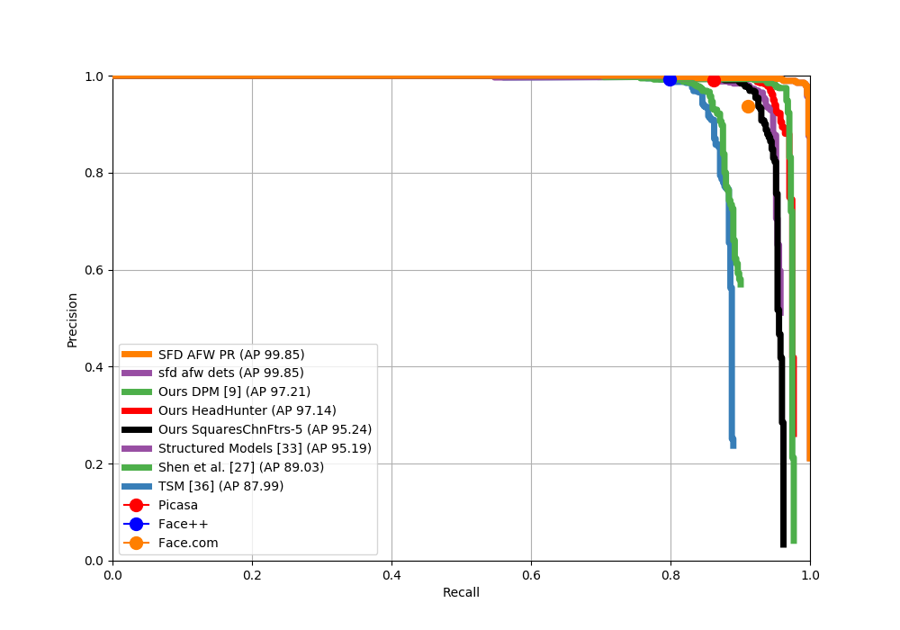
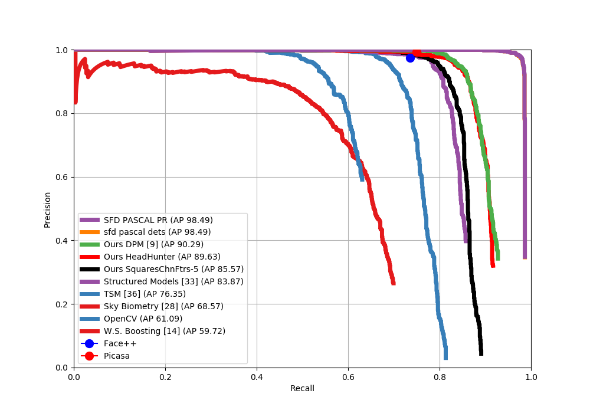
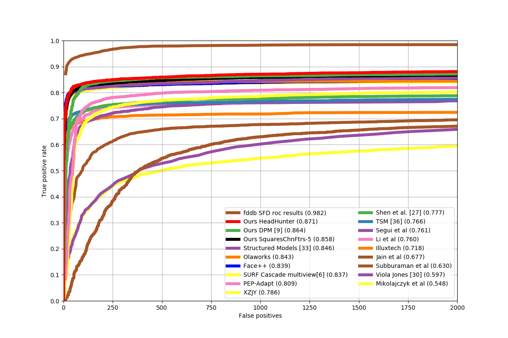
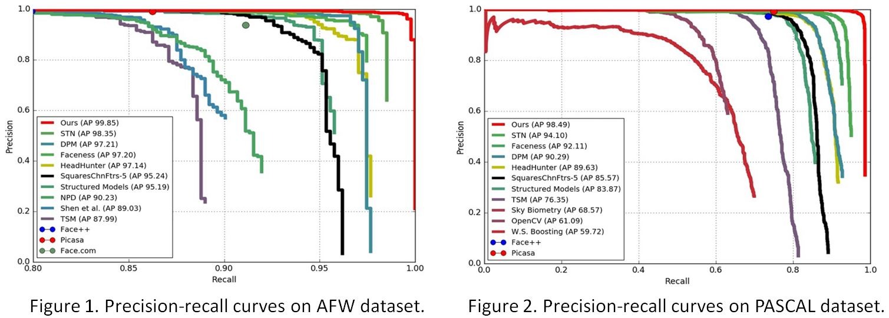
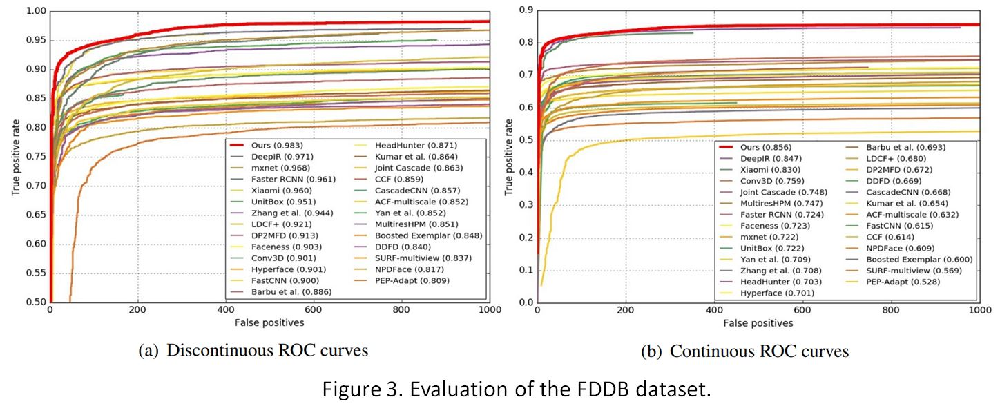

# Test instructions for S³FD: Single Shot Scale-invariant Face Detector

### Introduction

S³FD is a real-time face detector, which performs superiorly on various scales of faces with a single deep neural network, especially for small faces. For more details, please refer to their original [arXiv paper](https://arxiv.org/abs/1708.05237).

### Documentation

1. [Preparation](#preparation)
2. [Download of datasets](#download-datasets)
3. [Compile and Run SFD detector](#test-sfd-detector)
4. [Running evaluation benchmarks](#running-evaluation-benchmark)
5. [Reproduced Results](#reproduced-results)
6. [Reference Results](#reference-results)
7. [Issues encountered](#issues-encountered)

### Preparation

1. To install the proper version of Caffe, follow the [SSD Installation Instructions](./SSD-install.md)

2. Download the authors' [pre-trained model](https://drive.google.com/open?id=1CboBIsjcDQ-FC1rMES6IjTl6sYQDoD6u). To do so, you can run:
    
    ```Shell
    ./scripts/data/download_model.sh
    ```

    The model will be located in `$CAFFE/models/sfd_models/VGGNet/WIDER_FACE/SFD_trained`.

3. Clone this repository [SFD](https://github.com/bonseyes/SFD) in `$CAFFE/SFD`. Make sure that the folder `$CAFFE/SFD/sfd_test_code` exists.

### Download datasets

To automatically download the datasets, you can execute

```Shell
./scripts/datasets/download_datasets.sh -d desired/path/for/datasets
```

You can also download them manually:
1. [AFW](http://www.ics.uci.edu/~xzhu/face/)
2. [FDDB](http://vis-www.cs.umass.edu/fddb/index.html)
3. [PASCAL face (train/validataion)](http://host.robots.ox.ac.uk/pascal/VOC/voc2012/index.html) and [PASCAL face (test)](http://host.robots.ox.ac.uk:8080/eval/challenges/voc2012/)
4. [WIDER FACE](http://mmlab.ie.cuhk.edu.hk/projects/WIDERFace/)

### Test SFD detector

The test scripts are located in `$SFD_ROOT/sfd_test_code/`

#### Test SFD on AFW, PASCAL Face, FDDB

To test with those datasets, use the `test.py` script, for example:

```
python2.7 test.py -d FDDB -p ../datasets/FDDB/
python2.7 test.py -d AFW -p ../datasets/AFW/testimages
python2.7 test.py -d PASCAL -p ../datasets/PASCAL/VOCdevkit/VOC2012/JPEGImages
```

Remember to change paths accordingly. Run `test.py -h` to see a list of valid arguments.

The test will output, for each dataset, a file in `$SFD_ROOT/sfd_test_code/{AFW,PASCAL,FDDB}/sfd_{afw,pascal,fddb}_dets.txt` which can be used with the `face-eval` tool to plot the precision-recall curves ([Next Section](#runningevaluationbenchmarks). 


NOTE: The original paper uses a Matlab script to transform the rectangular predictions into ellipsis. If you have acces to a Matlab license, you can do that by running:
```Shell
# Fitting the dets from rectangle box to ellipse box.
# It will creat sfd_fddb_dets_fit.txt and put it in the FDDB evalution code to evalute.
cd fddb_from_rectangle_to_ellipse
matlab -nodesktop -nosplash -nojvm -r "run fitting.m;quit;"
# If you want to get the results of FDDB in our paper, you should use our 'FDDB_annotation_ellipseList_new.txt'
  ```

#### Test SFD on WIDER FACE
```Shell
cd $SFD_ROOT/sfd_test_code/WIDER_FACE
# You must modify the path in the wider_test.py to your WIDERFACE path. 
# It will create detection results in the "eval_tools_old-version" folder.
python wider_test.py
# If you want to get the results of val set in our paper, you should use the provided "eval_tools_old-version". 
# Or you can use latest eval_tools of WIDER FACE.
# There is a slight difference between them, since the annotation used for the evaluation is slightly change around March 2017.
```

### Running evaluation benchmarks

Download the [EVALUATION TOOLBOX](https://bitbucket.org/marcopede/face-eval) for evaluation. We call this directory `$CAFFE/SFD/face-eval`.

#### Plotting Precision-Recall curves for AFW and PASCAL

1. Copy the previously generated file `./{AFW,PASCAL}/sfd_{afw,pascal}_dets.txt` into `face-eval/detections/{AFW,PASCAL}` respectively.

2. Run:

    ```
    cd ${face_eval_dir}
    # For AFW
    python2.7 plot_AP.py --dataset AFW
    # For PASCAL
    python2.7 plot_AP.py --dataset PASCAL 
    ```

3. Two PDFs files will be generated, `AFW_final.pdf` and `PASCAL_final.pdf` with their respectives Precision-Recall curves.

#### Plotting Precision-Recall curve for FDDB

The generated file by `test.py` has this format for FDDB:

```
<image name i>
<number of faces in this image =im>
<face i1>
<face i2>
...
<face im>
...

Where each face is represented as a rectangle:

       <left_x top_y width height detection_score> 
```

In order to feed these results to `face-eval`, we need to transform them into the TPR/FPR values. For that you need to follow these steps:

1. Get the list of all the test images. This can be obtained by merging all the [10-fold splits](http://vis-www.cs.umass.edu/fddb/FDDB-folds.tgz) into one single file (use the `*-ellipseList.txt` ones). This project already has that list under `paper/FDDB_annotation_ellipseList_new.txt`.

2. Get the original [evaluation code for FDDB](http://vis-www.cs.umass.edu/fddb/evaluation.tgz). Download it somewhere and compile it. If you are using a newer version of OpenCV (you should have it installed if you compiled Caffe), you will have to modify the `Makefile` in order to link the code correctly:

    - Check where your OpenCV pkg is with `pkg-config --cflags opencv`. Set the variable `INCS` of the Makefile to that path.
    - Check your OpenCV libs with `pkg-config --libs opencv`. Set the variable `LIBS` with those values.
    - Modify the `evaluate` rule: 
        ```
        evaluate: $(OBJS)
          	$(CC) $(OBJS) -o $@ $(LIBS)
        ```
    - Run `make`. If you face any trouble please visit the [Official FDDB FAQ](http://vis-www.cs.umass.edu/fddb/faq.html)

3. Once you have successfully compiled the `evaluate` binary, you can process the detections:

    ```
    ./evaluate -a path/to/all_faces_ellipse_list -d path/to/generated/detections/by/testpy/ -f 0 -i path/where/FDDB/images/are/ -l image/list/to/test/ -r <prefix of output files> 

    # For example
    ./evaluate -a ../sfd_test_code/FDDB/all_folds_ellipseList.label -d ../sfd_test_code/FDDB/sfd_fddb_dets.txt -f 0 -i ../datasets/FDDB/ -l ../sfd_test_code/FDDB/fddb_img_list.txt -r roc_results
    ```
   To check what each argument means, run `./evaluate -h`

4. The previous step should have produced 2 files: `<prefix>ContROC.txt` and `<prefix>DiscROC.txt`, which correspond to the Continous ROC and Discontinuous ROC curves respectively. `face-eval` uses the Discontinuous ROC, so copy that file into `face-eval/detections/fddb/`

5. Go to `face-eval` and run `python2.7 plot_AP_fddb.py`

6. A `FDDB_final.pdf` file should be generated with the ROC curves.

NOTE: Mind that the ROC curves in the original paper for FDDB compare against more models whereas `face-eval` has fewer models to compare. Anyway, you should check that the Discontinuous ROC value is around 0.983.

### Reproduced Results
1. AFW 

2. PASCAL face

3. FDDB


#### Reference Results
Results from the original paper





### Issues encountered

#### 1. While testing on pascal dataset, some images listed in "sfd_test_code/PASCAL_face/pascal_img_list.txt" are not found.
    I used PASCAL dataset from VOCtrainval_11-May-2012.tar (VOCdevkit/VOC2012/JPEGImages).
    for example "2008_000216.jpg" image in pascal_img_list.txt is not in dataset. <br />

    Solution: Mix training-validation dataset with test dataset from pascal 2012 cahallenge. After mixing [training/validation data](http://host.robots.ox.ac.uk/pascal/VOC/voc2012/index.html) with [test data](http://host.robots.ox.ac.uk:8080/eval/challenges/voc2012/), all the pascal images listed in "sfd_test_code/PASCAL_face/pascal_img_list.txt" are available in merged folder. 
    This is now done automatically by the dataset downloading scripts.

#### 2. After the AFW/PASCAL dataset evaluation of our detector and other detector present in EVALUATION TOOLBOX, the result of SFD detector is not as expected.
    Seems something wrong as ROC curve of our detector is very poor. <br />
    Solution: Fixed. The detection result in AFW dataset is now exactly same as in the original paper. It was because of wrong linkag e of deploy.prototxt! <br />

#### 3. The detection result in PASCAL face is 97.60% where as in original paper it is 98.49%
    Solution: Using the correct version of Python and recompiling Caffe got PASCAL-face to 98.49
